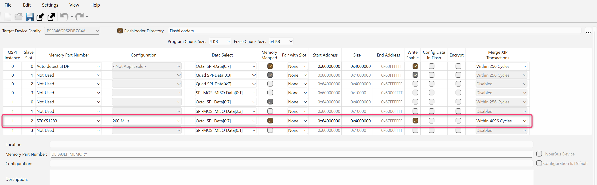

# Switching the boot flow to an external OSPI flash

The PSOC&trade; Edge E84 Evaluation Kit supports booting from the following two external memories:
- Quad Serial Peripheral Interface (QSPI) flash
- Octal Serial Peripheral Interface (OSPI) flash

This code example is configured to boot from the external OSPI flash and except this code example most of other code examples including the [Hello world](https://github.com/Infineon/mtb-example-psoc-edge-hello-world) code example are configured to boot from the external QSPI flash. For more details, see the "Booting from external OSPI flash" section in the [AN235935 – Getting started with PSOC&trade; Edge E8 on ModusToolbox&trade; software](https://www.infineon.com/AN235935).

## Boot from the external OSPI flash

Boot from an external OSPI flash performs the following:

- As a prerequisite, follow the steps mentioned in the "Getting started" section in the [AN237849 – Getting Started with the PSOC&trade; Edge security](https://www.infineon.com/AN237849) to generate your keys and certificate and provision the device to transfer ownership
- Provision the PSOC&trade; Edge E84 Evaluation Kit with the correct extended boot policy configurations required for switching the boot flow to Octal SPI. For details about provisioning and policy configurations, see the "Switching between Octal and Quad SPI external flash memory" section in the [AN237849 – Getting started with the PSOC&trade; Edge security](https://www.infineon.com/AN237849)
- In the code example, change the external flash configration in the QSPI Configurator as shown below

  **Figure 1. OSPI settings in the QSPI Configurator**
  

> **Note:** To execute any other code examples including the [Hello world](https://github.com/Infineon/mtb-example-psoc-edge-hello-world) code example, provision the PSOC&trade; Edge E84 Evaluation Kit again with correct extended boot policy configurations for switching the boot flow to QSPI flash. For details about provisioning and policy configurations, see the "Switching between Octal and Quad SPI external flash memory" section in the [AN237849 – Getting started with the PSOC&trade; Edge security](https://www.infineon.com/AN237849).
